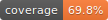

# restgdf

improved esri rest io for geopandas


[](https://opensource.org/license/bsd-3-clause/)
[](https://www.python.org)

[](https://github.com/joshuasundance-swca/restgdf/actions/workflows/publish_on_pypi.yml)

[](https://restgdf.readthedocs.io/en/latest/)


[](./COVERAGE.md)

[](https://github.com/pre-commit/pre-commit)
[](https://github.com/charliermarsh/ruff)
[](http://mypy-lang.org/)
[](https://github.com/psf/black)

[](https://github.com/PyCQA/bandit)


`gpd.read_file(url, driver="ESRIJSON")` does not account for max record count limitations

so if you read a service with 100000 features but there's a limit of 1000 records per query, then your gdf will only have 1000 features

these functions use asyncio to read all features from a service, not limited by max record count

keyword arguments to `FeatureLayer.getgdf` are passed on to `requests.Session.post`; include query parameters like where str and token str in data dict

this enables enhanced control over queries and allow use of any valid authentication scheme (eg `requests_ntlm.HttpNtlmAuth`) with use of `requests.Session.auth` or `data={"token": str}`

# Usage

```bash
pip install restgdf
```

```python
import asyncio

from aiohttp import ClientSession

from restgdf import FeatureLayer


beaches_url = r"https://maps1.vcgov.org/arcgis/rest/services/Beaches/MapServer/6"

zipcodes_url = "https://services.arcgis.com/P3ePLMYs2RVChkJx/ArcGIS/rest/services/USA_ZIP_Codes_2016/FeatureServer/0"

async def main():
    async with ClientSession() as session:
        beaches = await FeatureLayer.from_url(beaches_url, session=session)
        beaches_gdf = await beaches.getgdf()

        daytona = await beaches.where("LOWER(City) LIKE 'daytona%'")
        daytona_gdf = await daytona.getgdf()

        oh_zipcodes = await FeatureLayer.from_url(zipcodes_url, where="STATE = 'OH'", session=session)
        oh_zipcodes_gdf = await oh_zipcodes.getgdf()

    return beaches_gdf, daytona_gdf, oh_zipcodes_gdf


beaches_gdf, daytona_gdf, oh_zipcodes_gdf = asyncio.run(main())

print(beaches_gdf.shape)
# (243, 10)

print(daytona_gdf.shape)
# (83, 10)

print(oh_zipcodes_gdf.shape)
# (1026, 8)
```

# Documentation

https://restgdf.readthedocs.io/

# Uses

- [restgdf_api](https://github.com/joshuasundance-swca/restgdf_api)
- [govgis_nov2023](https://huggingface.co/datasets/joshuasundance/govgis_nov2023)
